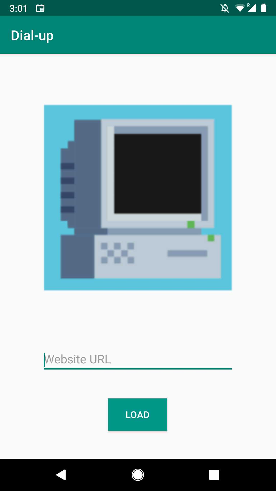
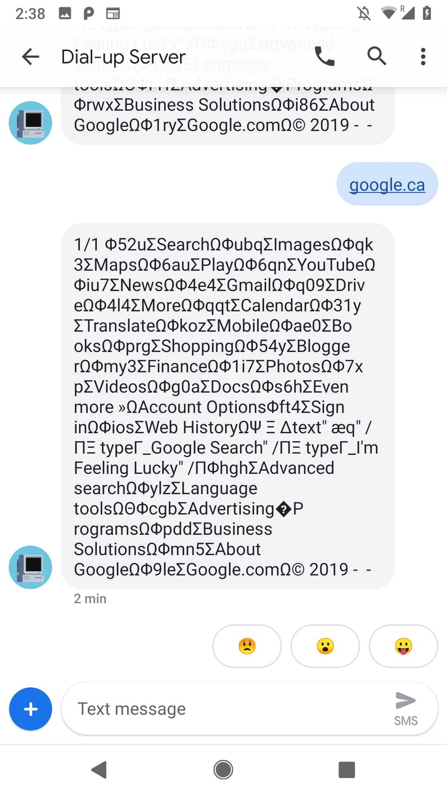
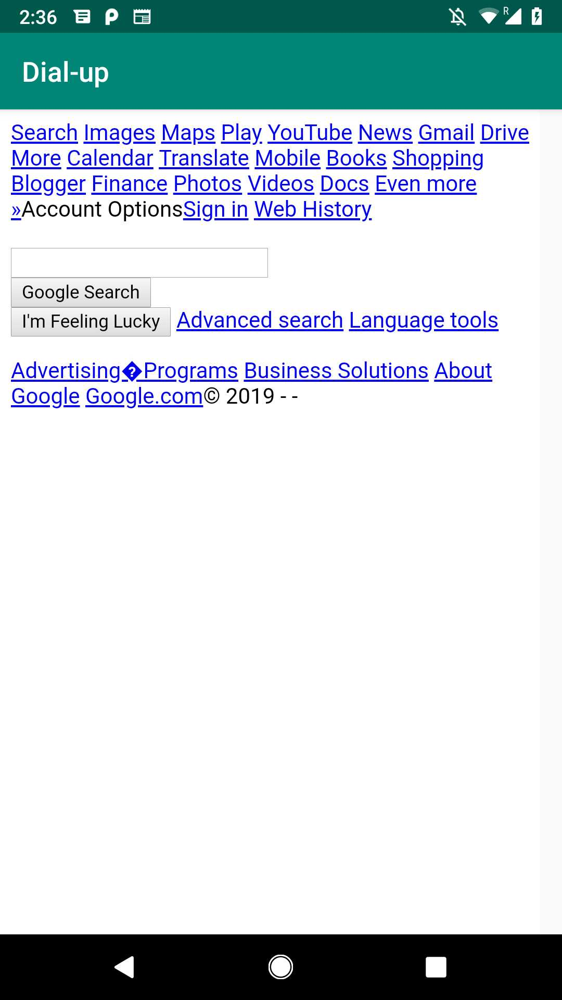

# Dial-up (App)

## Access the internet over SMS!

### To see the companion server, check out this repo: https://github.com/alexandra03/dialup-server

### To run: clone the repo, set up a Twilio account, update the phone number in MainActivity.java, build the app in Android Studio, and browse away!

### Screenshots: request a webpage, see the SMS conversation in your default messaging app, and see the rendered webpage.

